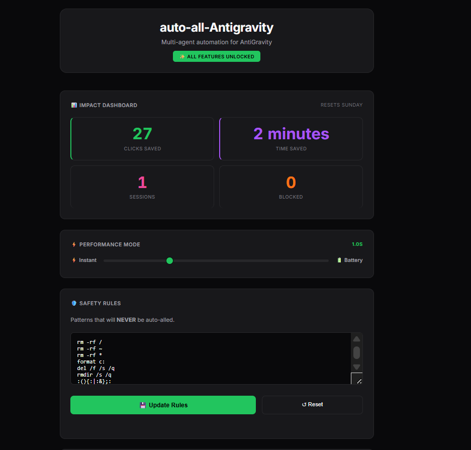

# auto-all-Antigravity

  <strong>Unleash Your AI Agents. Zero Interruptions.</strong>

  

  <a href="https://github.com/ai-dev-2024/AUTO-ALL-AntiGravity">GitHub</a> •
  <a href="https://open-vsx.org/extension/auto-all-antigravity/auto-all-antigravity">Extension Page</a> •
  <a href="https://ko-fi.com/ai_dev_2024">☕ Support</a>

---

## ✨ What is this?

**auto-all-Antigravity** is a refined, production-ready fork that automates the repetitive approval prompts in AI-powered IDEs like **Antigravity** and **Cursor**. It silently handles file edits, terminal commands, and agent recovery, letting your AI work continuously.

**✅ Proven & Tested** with VS Code, Antigravity IDE, and Cursor.

**✅ 100% Free. No Paywalls. All Features Unlocked.**

---

## 📸 Dashboard

  

The built-in dashboard tracks your productivity gains: clicks saved, time recovered, and blocked commands.

---

## ⚡ Key Features

| Feature | Description |
| :--- | :--- |
| **Auto-Accept File Edits** | Instantly applies AI-suggested code changes. |
| **Auto-Execute Terminal Commands** | Runs approved commands without manual clicks. |
| **Auto-Recover Stuck Agents** | Automatically retries when agents get stuck. |
| **Multi-Tab Mode** | Monitors all open AI sessions in parallel. |
| **Safety Blocklist** | Prevents dangerous commands (e.g. `rm -rf /`) from running. |
| **Impact Dashboard** | Visual stats on time and clicks saved. |

---

## 🛡️ Safety First

Automation shouldn't mean danger. The extension includes a customizable blocklist to prevent destructive commands from ever running automatically.

  

---

## 📥 Installation

1. **Download** from the [Open VSX Registry](https://open-vsx.org/extension/auto-all-antigravity/auto-all-antigravity).
2. **Reload** your editor.
3. **Enjoy** autonomous coding—it starts working immediately.

Look for `auto-all-Antigravity: ON` in the status bar.

---

## 🤝 Support

This is a free, open-source project. If it saves you time, consider supporting development:

---

## 🙏 Acknowledgements

This project is a refined fork of [auto-accept-agent](https://github.com/Munkhin/auto-accept-agent) by MunKhin. Full credit to the original author for the foundational work.

---

## 📜 License

MIT License. Open and free forever.

  Made with ❤️ for the AI community

